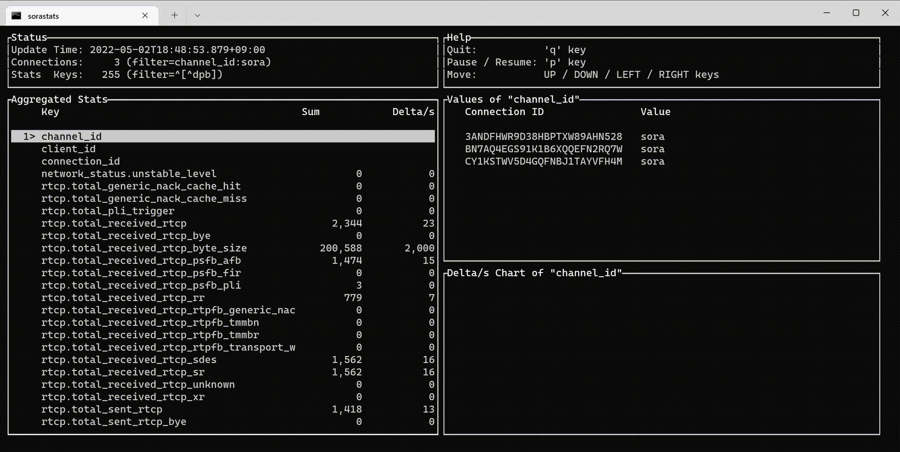

sorastats
=========

[](https://crates.io/crates/sorastats)
[](https://github.com/sile/sorastats/actions)


[WebRTC SFU Sora] の[統計情報][統計 API]をターミナルで閲覧するためのビューアです。



[WebRTC SFU Sora]: https://sora.shiguredo.jp/
[統計 API]: https://sora-doc.shiguredo.jp/API#dacb9c


インストール
------------

### ビルド済みバイナリ

Linux および MacOS 向けにはビルド済みバイナリが[リリースページ]で提供されています。

```console
// Linux でビルド済みバイナリを取得する例
$ curl -L https://github.com/sile/sorastats/releases/download/0.2.0/sorastats-0.2.0.x86_64-unknown-linux-musl -o sorastats
$ chmod +x sorastats
$ ./sorastats
```

[リリースページ]: https://github.com/sile/sorastats/releases

### [Cargo] でインストール

[Rust] のパッケージマネージャである [Cargo] がインストール済みの場合には、以下のコマンドが利用可能です:

```console
$ cargo install sorastats
$ sorastats
```

[Rust]: https://www.rust-lang.org/
[Cargo]: https://doc.rust-lang.org/cargo/

使い方
------

第一引数に Sora の API の URL を指定してコマンドを実行してください:

```console
$ sorastats ${SORA_API_URL}
```

### 用語

- **Value**
  - 個々のコネクションの統計値
- **Sum**
  - 全てのコネクションの統計値の合算
  - 統計値の種類が数値以外の場合には存在しない
- **Delta/s**
  - 今回と前回の統計値（**Sum** or **Value**）の差分を毎秒単位に変換した値
  - 統計値の種類が数値以外の場合には存在しない

### 各種オプション

`$ sorastats --help` コマンドを叩くと、以下のようなヘルプメッセージが表示されます。

```console
$ sorastats 0.1.1
WebRTC SFU Sora の統計情報ビューア

USAGE:
    sorastats [OPTIONS] <SORA_API_URL>

ARGS:
    <SORA_API_URL>
            「Sora の API の URL（リアルタイムモード）」あるいは「過去に `--record`
            で記録したファイルのパス（リプレイモード）」

OPTIONS:
    -c, --connection-filter <CONNECTION_FILTER>
            集計対象に含めるコネクションをフィルタするための正規表現

            コネクションの各統計値は "${KEY}:${VALUE}" という形式の文字列に変換された上で、
            指定の正規表現にマッチ（部分一致）するかどうかがチェックされる。
            一つでもマッチする統計値が存在する場合には、そのコネクションは集計対象に含まれる。

            例えば、チャンネル名が "sora" のコネクションのみを対象にしたい場合には
            "^channel_id:sora$" という正規表現を指定すると良い。

            [default: .*:.*]

    -h, --help
            Print help information

    -i, --polling-interval <POLLING_INTERVAL>
            統計 API から情報を取得する間隔（秒単位）

            [default: 1]

    -k, --stats-key-filter <STATS_KEY_FILTER>
            集計対象に含める統計項目をフィルタするための正規表現

            指定された正規表現にマッチ（部分一致）する統計項目のみが表示される。

            例えば、 RTP 関連の統計情報のみを対象としたい場合には "^rtp[.]"
            という正規表現を指定すると良い。

            [default: .*]

    -p, --chart-time-period <CHART_TIME_PERIOD>
            チャートの X 軸の表示期間（秒単位）

            [default: 60]

        --record <RECORD>
            指定されたファイルに取得した統計情報を記録する

            `<SORA_API_URL>`引数に URL の代わりにこのファイルへのパスを指定することで、
            記録した統計情報を後から閲覧することができる（リプレイモード）

            リプレイモードの場合には、このオプションを指定しても無視される

    -V, --version
            Print version information
```
